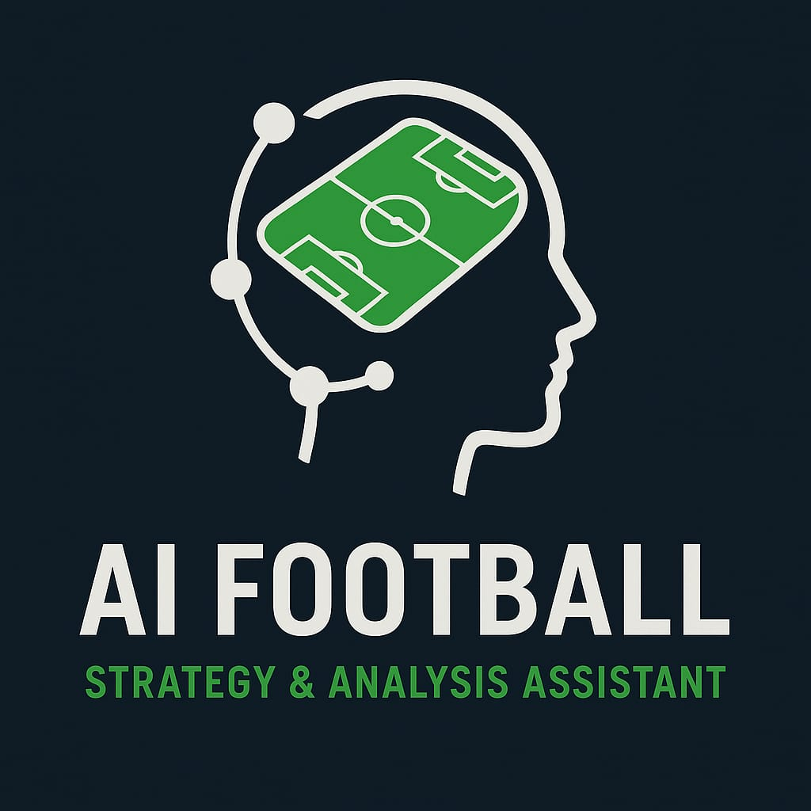

<p align="center">
  
</p>

<h1 align="center">⚽ AI Football Strategy & Analysis Assistant</h1>

<p align="center"><em>"In football, the worst blindness is only seeing the ball." – Nelson Falcão Rodrigues</em></p>

---

## 📌 Overview
The **AI Football Strategy & Analysis Assistant** is a conversational tool designed for football coaches and analysts.  
It processes match footage, extracts performance insights, and provides tactical recommendations in real time — all through natural voice interaction.

Built for the **ElevenLabs AI Sports Coach Challenge**, our goal is to **bring professional-grade match analysis to every coach**, everywhere.

---

## 🚀 Features (MVP)
- **🎥 Video Analysis** — Detects and tracks players from match clips.
- **📊 Key Match Stats** — Possession, passes, shots, goals, and more.
- **🗣 Conversational Insights** — Ask questions and get real-time answers via ElevenLabs AI voice.
- **📌 Tactical Recommendations** — Suggests improvements based on match data.
- *(Optional)* Annotated clips with highlights.

---

## 🛠 Tech Stack
- **Frontend:** React Native / Web (for chat, video upload, stats display)
- **Backend:** Python (FastAPI/Flask) + OpenCV + YOLOv8
- **AI/Voice:** ElevenLabs Conversational AI + GPT API
- **Data:** Video footage (MP4), extracted JSON stats

---

## 📂 Repository Structure
```

.
├── assets/             # Images, logo, UI mockups
├── backend/            # Video processing, AI analysis scripts
├── frontend/           # UI components & integration
├── README.md           # Project documentation
└── requirements.txt    # Python dependencies

```

---

## 👥 Team
- **Person A** — AI & Video Processing
- **Person B** — Conversational Agent Integration
- **Person C** — UI/UX & Demo Preparation

---

## 📅 Hackathon Timeline
**Day 1:** Setup, MVP feature implementation, integration  
**Day 2:** Polish, bug fixes, final demo preparation

---

## 📸 Screenshots / Demo
*(Add once implemented)*

---

## 💡 Inspiration
We believe every coach should have access to **data-driven tactical insights** — not just top-tier clubs.  
This project aims to **democratize match analysis** through AI, voice technology, and computer vision.

---

## 📜 License
This project is licensed under the MIT License — see the [LICENSE](LICENSE) file for details.
```

---