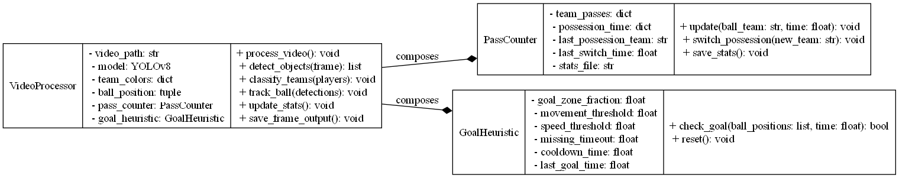

# Soccer Match Video Analysis System

## 1. Overview

This system processes soccer match footage to automatically detect:

- **Players** and assign them to teams based on jersey colors.
- **Ball** position in real time.
- **Passes** between players.
- **Possession time** for each team.
- **Goals** using a **flexible heuristic** that accounts for both fast and slow ball movements.

It runs locally using **YOLOv8** for object detection and OpenCV for image processing and visualization.

---

## 2. Architecture

### 2.1 Detection Module

- **Model:** YOLOv8n (`yolov8n.pt`), pretrained on COCO.
- **Classes Used:**
  - Class `0`: Person (players)
  - Class `32`: Sports ball
- **Function:**  
  Each frame is processed to extract:
  - `people_xywh` → player bounding boxes.
  - `best_ball` → the most confident ball detection.

---

### 2.2 Team Classification Module

- **Bootstrap Process:**  
  The first 20 seconds of footage are used to collect torso crops from detected players.
- **Color Clustering:**  
  Dominant jersey hues are computed in HSV space and clustered into **TeamA** and **TeamB** using a circular hue distance metric.
- **Assignment Function:**  
  Each player is labeled `TeamA`, `TeamB`, or `Unknown` based on hue proximity to team centroids.

---

### 2.3 Stats Tracking Module

Implemented in the **`PassCounter`** class:

- **Pass Detection:**  
  If ball possession switches between two teams, a pass is recorded for the new team.
- **Possession Time:**  
  The owning team accumulates time until possession changes.
- **Summary Output:**  
  Pass counts and possession time are periodically written to `stats_latest.json`.

---

### 2.4 Goal Detection Module

Implemented in the **`GoalHeuristic`** class:

- **Purpose:** Detect goals based on ball movement patterns and disappearance events.
- **Parameters:**
  - `goal_zone_frac` → % of field width considered as goal zone.
  - `far_px` → large displacement threshold.
  - `small_px` → minimal movement threshold.
  - `min_speed_pxps` → speed threshold for fast approaches.
  - `missing_timeout` → time ball must be missing to count as gone.
  - `cooldown_s` → prevent double-counting goals.
- **Goal Triggers:**
  1. **Big jump** into goal zone.
  2. **Fast + missing** ball in goal zone.
  3. **Slow + missing** ball near goal.
  4. **Teleport** disappearance near goal.

---

## 3. Data Flow

1. Read a frame from the video.
2. Run YOLO detection for players and ball.
3. Classify players into teams using hue clustering.
4. Track ball position with smoothing.
5. Update stats:
   - Passes.
   - Possession time.
6. Check for goals using `goal_logic.update(...)`.
7. Save stats every `stats_interval` seconds.
8. Display annotated frame.

---

## 4. Outputs

### 4.1 On-Screen Visualization

- Bounding boxes for players (team-colored).
- Yellow circle for ball.
- Pass notifications.
- Goal notifications.

### 4.2 Statistics File (`stats_latest.json`)

```json
{
  "passes": { "TeamA": 5, "TeamB": 3 },
  "possession_seconds": { "TeamA": 120.5, "TeamB": 95.3 },
  "goals": { "TeamA": 1, "TeamB": 2 }
}
```

## 5. Class Diagram

The following diagram illustrates the main classes and their relationships in the system:

