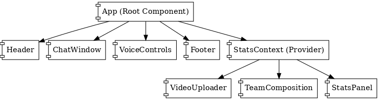

# Frontend - AI Football Assistant

## Overview

This is the frontend application for the AI Football Assistant project, built with React, TypeScript, and Vite. The app provides an interactive interface for uploading football match videos, viewing statistics, team compositions, and interacting with AI-powered chat and voice features.

---

## Table of Contents

- [Overview](#overview)
- [Features](#features)
- [Project Structure](#project-structure)
- [App Components](#app-components)
- [Getting Started](#getting-started)
- [Development](#development)
- [Diagrams](#diagrams)
- [App Template](#app-template)
- [License](#license)

---

## Features

- Video upload and processing
- Real-time football statistics display
- Team composition visualization
- AI-powered chat assistant
- Voice controls and ElevenLabs integration

---

## Project Structure

```
frontend/
  ├── src/
  │   ├── components/         # React UI components
  │   ├── services/           # API and external service integrations
  │   ├── types/              # TypeScript type definitions
  │   └── utils/              # Utility functions and context
  ├── index.html              # Main HTML file
  ├── package.json            # Project dependencies and scripts
  └── ...                     # Config and static assets
```

---

## App Components

- **App.tsx**: Main application entry point, sets up routing and context.
- **ChatWindow.tsx**: Chat interface for interacting with the AI assistant.
- **StatsPanel.tsx**: Displays real-time match statistics.
- **TeamComposition.tsx**: Visualizes team lineups and player positions.
- **VideoUploader.tsx**: Handles video file uploads to the backend.
- **VoiceControls.tsx**: Provides voice command and ElevenLabs voice synthesis features.
- **backendService.ts**: Handles API requests to the backend server.
- **elevenLabsService.ts**: Integrates with ElevenLabs for voice features.
- **StatsContext.tsx**: React context for sharing statistics data across components.

---

## Getting Started

1. **Install dependencies:**
   ```sh
   npm install
   ```
2. **Start the development server:**
   ```sh
   npm run dev
   ```
3. **Open the app:**
   Visit [http://localhost:5173](http://localhost:5173) in your browser.

---

## Development

- **Tech Stack:** React, TypeScript, Vite, Tailwind CSS
- **Linting:** ESLint
- **Styling:** Tailwind CSS
- **API Integration:** Communicates with the backend via REST endpoints

---

## Diagrams

### Use Case Diagram


### App Component Diagram



---

## App Template


---

## License

This project is licensed under the MIT License.
This project is licensed under the MIT License.
